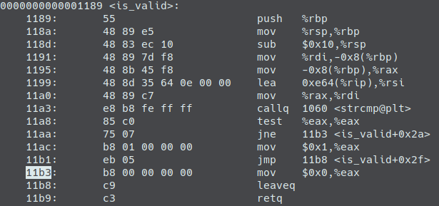
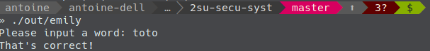

# Reverse engineering

## Crack Emily

Le code source de crack emily se trouve dans *src/crack-emily/main.c*.

### La commande file

Je compile de la manière suivante :

```sh
gcc -o out/emily src/crack-emily/main.c
```

Voici le résultat lorsque je tape la commande `file` sur le binaire résultant d'une compilation :

```txt
out/emily: ELF 64-bit LSB pie executable, x86-64, version 1 (SYSV), dynamically linked, interpreter /lib64/ld-linux-x86-64.so.2, BuildID[sha1]=9e8784798ee455d0a9ae5fb1f0a8c728089457d0, for GNU/Linux 3.2.0, not stripped
```

On remarque que ce binaire dépend de la librairie dynamique `ld-linux-x86-64.so.2`. Cette dépendance peut etre levé grâce à une compilation statique :

```sh
gcc -o out/emily src/crack-emily/main.c --static
```

Ce qui donne un résultat différent pour la commande `file` :

```sh
out/emily: ELF 64-bit LSB executable, x86-64, version 1 (GNU/Linux), statically linked, BuildID[sha1]=8f023c1480d076c9637dbc00c21b6d138a244f74, for GNU/Linux 3.2.0, not stripped
```

Il est aussi possible de changer le `not stripped` en `stripped`. Pour cela il suffit d'appeler la commande `strip` sur le binaire apres l'avoir compilé.

### Trouver le mot de passe

La commande `string` nous permet de voir les chaine de caractères humainement compréhensible. Dans le cas où le mot est stocké en dur et en clair, cela sera facile pour nous de le trouver à travers les résultats de cette commande.

### Patcher le binaire

### is_valid



Dans ce petit morceaux d'assembleur on retrouve l'appelle à strcmp, puis la comparaison avec 0 via l'instruction `test %eax, %eax`. C'est ce test qui détermine le résultats de la fonction `is_valid`. Notre but est de faire en sorte que la branche dans laquelle on tombe apres ce test n'impacte en rien le résultat de la fonction.

On remarque dans la capture précédente que le return 0 ou return 1 est fait en deux étape. D'abord on met la valeur de retour dans le registre eax, puis on termine la fonction avec `retq`. Notre but va être d'écraser le 0 se trouvant à l'offset 0x11b4 pour le mettre à 1. Pour patcher le binaire on utilise la commande `dd`. On exécute alors la commande suivante:

```sh
python -c "print('\x01')" | dd of=out/emily count=1 bs=1 conv=notrunc seek=4532
```

Voici le résultat après un patch réussi.



**NOTE**: Le fuzzer écrit pour le TD4 m'a permis de voir que l'offset 4523 est aussi un bon offset (j'explique dans le TD4) !