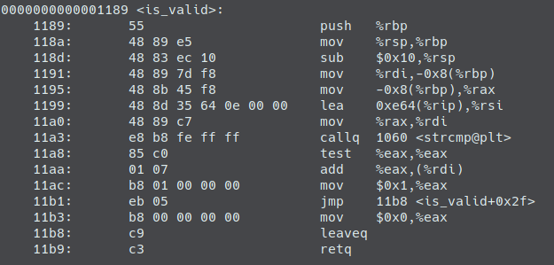
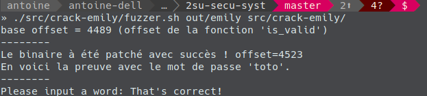

# Fuzzer pour crack emily

## Rappel

Dans le TD 1 on a vu qu'on devait placer la valeur 0x01 à un offset précis. l'intervention humaine réside dans la recherche de cet offset précis.

Le but de ce Fuzzer va être de trouver par lui même l'offset qui fonctionne.

## Le fuzzer

Le fuzzer se trouve dans *src/crack-emily/fuzzer.sh*. Il m'a permis de voir qu'il était possible de patcher le binaire en ne changeant que l'offset 4523 au lieu de 4532.

En fait ça change l'instruction `jne` en instruction `add`. L'effet de bord produit est que le programme ne saute jamais vers la branche normalement exécuté lorsque le strcmp est faux. On effectue ainsi toujours le `move $01,%eax` et le jump à la fin de la fonction.

Voici le code désassemblé apres ce drole de patch:

**NOTE**: Juste pour éviter la réexécution du script voici sa sortie sur ma machine:

